Raunak Garment's ecommerce app for shopping.

The default copyright laws apply, meaning that the repository owner (anu71195) retain all rights to the source code and no one may reproduce, distribute, or create derivative works from your work.
Client flow without interruption
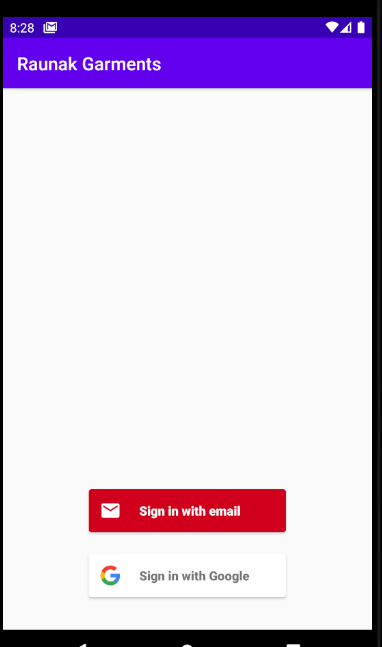
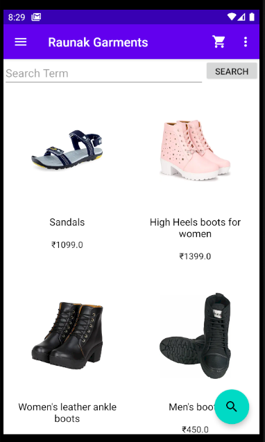
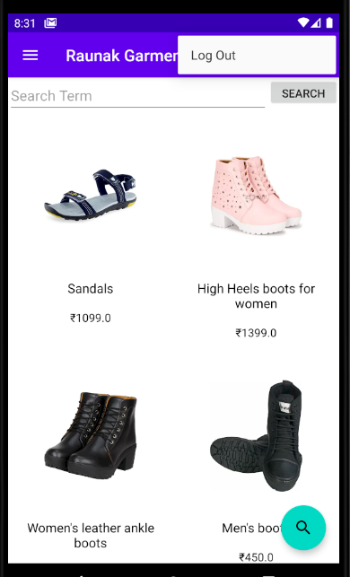
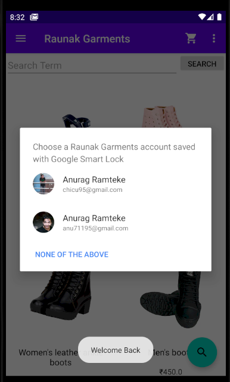
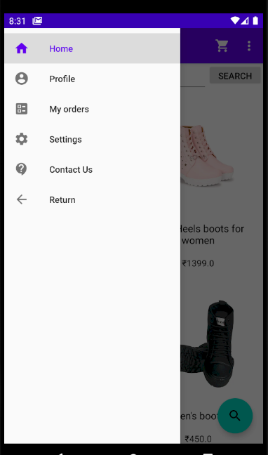
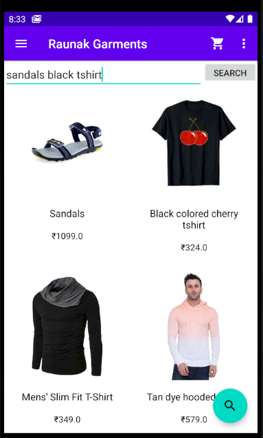
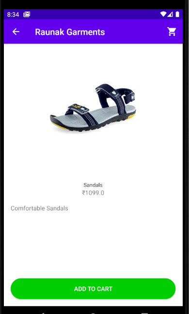
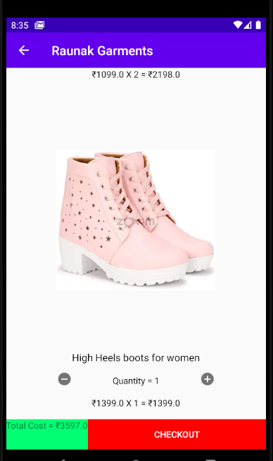
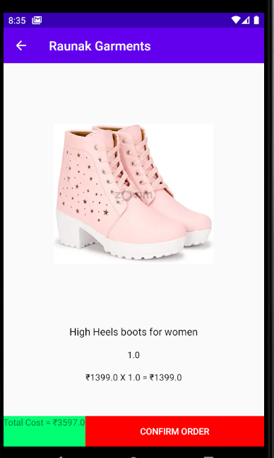
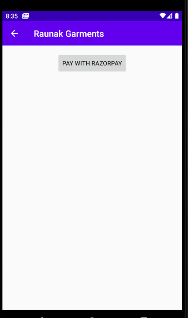
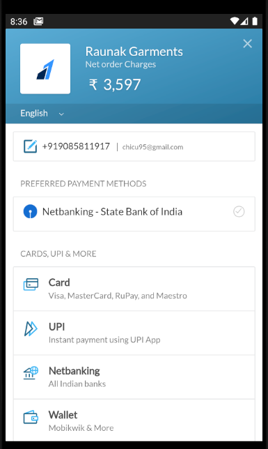

Client flow for profile and interruptions  

Client Flow for Settings

Client Flow for Contact Us Screen
