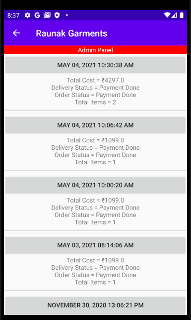
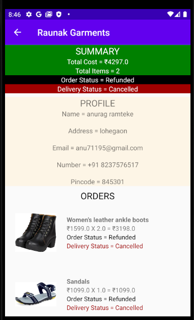

# Raunak Garment's ecommerce app for shopping.

## Table of contents
  
1. ### [Client flows](##Client-flows)
   1. #### Client flow without interruptions
   1. #### User order flow 
   1. ####  Empty cart flow
   1. #### Profile fields
   1. #### Profile fields error flow
   1. #### Client flow for settings
   1. #### Client flow for contact us screen
2. ### Admin flows
   1. #### Admin navigation flow
   1. #### Add product flow
   1. #### Edit product flow
   1. #### Delete product flow
   1. #### Orders flow
   1. #### Functions flow
   1. #### Developer flow

##Client flows  

### Client flow without interruptions  
 
 <table>
   <tr>
        <td style="text-align: center;"width=30%;">Login screen</td>
        <td style="text-align: center;"width=30%;">Home screen</td>
        <td style="text-align: center;"width=30%;">Logout option</td>
   </tr>
   <tr>
        <td></td>
        <td></td>
        <td></td>
   </tr>
 </table>

 <table>
   <tr>
        <td style="text-align: center;"width=30%;">Switch account popup on logout</td>
        <td style="text-align: center;"width=30%;">Navigation bar by clicking on stack structure on top left</td>
        <td style="text-align: center;"width=30%;">Search product</td>
   </tr>
   <tr>
        <td></td>
        <td></td>
        <td></td>
   </tr>
 </table>

<table>
   <tr>
        <td style="text-align: center;"width=30%;">Click on product from home screen</td>
        <td style="text-align: center;"width=30%;">Cart screen</td>
        <td style="text-align: center;"width=30%;">Confirm screen</td>
   </tr>
   <tr>
        <td></td>
        <td></td>
        <td></td>
   </tr>
 </table>
 
 <table>
    <tr>
         <td style="text-align: center;"width=30%;">Pay with razorpay screen</td>
         <td style="text-align: center;"width=30%;">Razorpay API window</td>
    </tr>
    <tr>
         <td></td>
         <td></td>
    </tr>
  </table> 

### User order flow  

<table>
   <tr>
        <td style="text-align: center;"width=30%;">Home screen</td>
        <td style="text-align: center;"width=30%;">Product 1</td>
        <td style="text-align: center;"width=30%;">Product 2</td>
   </tr>
   <tr>
        <td></td>
        <td></td>
        <td></td>
   </tr>
 </table>
 

<table>
   <tr>
        <td style="text-align: center;"width=30%;">Cart 1</td>
        <td style="text-align: center;"width=30%;">Cart 2</td>
        <td style="text-align: center;"width=30%;">Cart 3</td>
   </tr>
   <tr>
        <td></td>
        <td></td>
        <td></td>
   </tr>
 </table>

<table>
   <tr>
        <td style="text-align: center;"width=30%;">Confirm order 1</td>
        <td style="text-align: center;"width=30%;">Confirm order 2</td>
        <td style="text-align: center;"width=30%;">Pay with razorpay screen</td>
   </tr>
   <tr>
        <td></td>
        <td></td>
        <td></td>
   </tr>
 </table>

<table>
   <tr>
        <td style="text-align: center;"width=30%;">Razorpay API window</td>
        <td style="text-align: center;"width=30%;">Pay with razorpay screen after successful payment</td>
        <td style="text-align: center;"width=30%;">Orders' list screen</td>
   </tr>
   <tr>
        <td></td>
        <td></td>
        <td></td>
   </tr>
 </table>

<table>
   <tr>
        <td style="text-align: center;"width=30%;">Orders' list screen on click of description of one of the orders</td>
        <td style="text-align: center;"width=30%;">Orders' list screen on again click of description of one of the orders</td>
        <td style="text-align: center;"width=30%;">Order summary screen after clicking on button with date on previous screen</td>
   </tr>
   <tr>
        <td></td>
        <td></td>
        <td></td>
   </tr>
 </table>

###  Empty cart flow  

<table>
   <tr>
        <td style="text-align: center;"width=30%;">Cart when no item is added in it</td>
        <td style="text-align: center;"width=30%;">Trying to checkout when no item is added</td>
   </tr>
   <tr>
        <td></td>
        <td></td>
   </tr>
 </table>
  
### Profile fields  

<table>
   <tr>
        <td style="text-align: center;"width=30%;">Profile screen to show the fields</td>
        <td style="text-align: center;"width=30%;">Profile screen with all fields complete and validated</td>
   </tr>
   <tr>
        <td></td>
        <td></td>
   </tr>
 </table>

### Profile fields error flow  

<table>
   <tr>
        <td style="text-align: center;"width=30%;">Profile Screen opened for first time</td>
        <td style="text-align: center;"width=30%;">Trying to checkout with profile shown in previous screen</td>
        <td style="text-align: center;"width=30%;">Profile screen with updated address</td>
   </tr>
   <tr>
        <td></td>
        <td></td>
        <td></td>
   </tr>
 </table>

<table>
   <tr>
        <td style="text-align: center;"width=30%;">Trying to checkout with profile shown in previous screen i.e. with address updated</td>
        <td style="text-align: center;"width=30%;">Profile screen with updated pincode as well</td>
        <td style="text-align: center;"width=30%;">Trying to checkout with profile shown in previous screen i.e. with pincode updated as well</td>
   </tr>
   <tr>
        <td></td>
        <td></td>
        <td></td>
   </tr>
 </table>

### Client flow for settings  

<table>
   <tr>
        <td style="text-align: center;"width=30%;">Settings screen all options off (default screen)</td>
        <td style="text-align: center;"width=30%;">Settings screen all options on</td>
        <td style="text-align: center;"width=30%;">Home screen with all options on settings on i.e. it shows items which can't be bought now</td>
   </tr>
   <tr>
        <td></td>
        <td></td>
        <td></td>
   </tr>
 </table>
 
 <table>
    <tr>
         <td style="text-align: center;"width=30%;">Home screen with all options on settings on 2</td>
         <td style="text-align: center;"width=30%;">Product under Maintenance added to cart</td>
         <td style="text-align: center;"width=30%;">Home screen with all options on settings on 3</td>
    </tr>
    <tr>
         <td></td>
         <td></td>
         <td></td>
    </tr>
  </table>

<table>
   <tr>
        <td style="text-align: center;"width=30%;">Product not available added to cart</td>
        <td style="text-align: center;"width=30%;">Home screen with all options on settings on 4</td>
        <td style="text-align: center;"width=30%;">Available product added to cart</td>
   </tr>
   <tr>
        <td></td>
        <td></td>
        <td></td>
   </tr>
 </table>

<table>
   <tr>
        <td style="text-align: center;"width=30%;">Cart 1</td>
        <td style="text-align: center;"width=30%;">Cart 2</td>
        <td style="text-align: center;"width=30%;">Cart 3</td>
   </tr>
   <tr>
        <td></td>
        <td></td>
        <td></td>
   </tr>
 </table>

<table>
   <tr>
        <td style="text-align: center;"width=30%;">Cart 4</td>
        <td style="text-align: center;"width=30%;">Confirm order 1 with underMaintenace product can't be bought</td>
        <td style="text-align: center;"width=30%;">Confirm order 2 with non available product can't be bought</td>
   </tr>
   <tr>
        <td></td>
        <td></td>
        <td></td>
   </tr>
 </table>

<table>
   <tr>
        <td style="text-align: center;"width=30%;">Confirm order 3</td>
        <td style="text-align: center;"width=30%;">Confirm order 4</td>
        <td style="text-align: center;"width=30%;">Pay with razorpay screen</td>
   </tr>
   <tr>
        <td></td>
        <td></td>
        <td></td>
   </tr>
 </table>

<table>
   <tr>
        <td style="text-align: center;"width=30%;">Razorpay API window</td>
   </tr>
   <tr>
        <td></td>
   </tr>
 </table>
 

### Client flow for contact us screen  
<table>
   <tr>
        <td style="text-align: center;"width=30%;">Contact us screen</td>
   </tr>
   <tr>
        <td></td>
   </tr>
 </table>

## Admin flows  

### Admin navigation flow  

<table>
   <tr>
        <td style="text-align: center;"width=30%;">Navigation bar on user flow to acess admin flow</td>
        <td style="text-align: center;"width=30%;">Add product screen</td>
        <td style="text-align: center;"width=30%;">Navigation bar on admin flow</td>
   </tr>
   <tr>
        <td></td>
        <td></td>
        <td></td>
   </tr>
 </table>

### Add product flow  

<table>
   <tr>
        <td style="text-align: center;"width=30%;">Add product screen</td>
        <td style="text-align: center;"width=30%;">Admin home screen 1</td>
        <td style="text-align: center;"width=30%;">Admin home screen 2</td>
   </tr>
   <tr>
        <td></td>
        <td></td>
        <td></td>
   </tr>
 </table>

<table>
   <tr>
        <td style="text-align: center;"width=30%;">Empty add product screen</td>
        <td style="text-align: center;"width=30%;">Partially filled fields in add product screen</td>
        <td style="text-align: center;"width=30%;">Window displayed on click of upload image button and selecting the shown image</td>
   </tr>
   <tr>
        <td></td>
        <td></td>
        <td></td>
   </tr>
 </table>

<table>
   <tr>
        <td style="text-align: center;"width=30%;">Image uploaded to firebase and url is created as shown and image is displayed below</td>
        <td style="text-align: center;"width=30%;">Clicking on add product, product is added and screen is reset to empty fields</td>
        <td style="text-align: center;"width=30%;">Admin home screen with new added product</td>
   </tr>
   <tr>
        <td></td>
        <td></td>
        <td></td>
   </tr>
 </table>

<table>
   <tr>
        <td style="text-align: center;"width=30%;">Clicking on new added product from admin home screen</td>
        <td style="text-align: center;"width=30%;">Searching the new added product in admin home screen</td>
        <td style="text-align: center;"width=30%;">Searching the new added product in user home screen</td>
   </tr>
   <tr>
        <td></td>
        <td></td>
        <td></td>
   </tr>
 </table>

<table>
   <tr>
        <td style="text-align: center;"width=30%;">Clicking on new added product from user home screen</td>
   </tr>
   <tr>
        <td></td>
   </tr>
 </table>

### Edit product flow  

<table>
   <tr>
        <td style="text-align: center;"width=30%;">Admin home screen</td>
        <td style="text-align: center;"width=30%;">Clicking on a product from admin home screen</td>
        <td style="text-align: center;"width=30%;">Product edit screen</td>
   </tr>
   <tr>
        <td></td>
        <td></td>
        <td></td>
   </tr>
 </table>
 

<table>
   <tr>
        <td style="text-align: center;"width=30%;">Clicked on get locks</td>
        <td style="text-align: center;"width=30%;">Clicked on get product</td>
        <td style="text-align: center;"width=30%;">Changed product description and name</td>
   </tr>
   <tr>
        <td></td>
        <td></td>
        <td></td>
   </tr>
 </table>

<table>
   <tr>
        <td style="text-align: center;"width=30%;">Change confirmation popup on click of update product</td>
        <td style="text-align: center;"width=30%;">Clicking yes saved the description</td>
        <td style="text-align: center;"width=30%;">Clicked on release locks</td>
   </tr>
   <tr>
        <td></td>
        <td></td>
        <td></td>
   </tr>
 </table>

<table>
   <tr>
        <td style="text-align: center;"width=30%;">Admin home screen with updated product name</td>
        <td style="text-align: center;"width=30%;">Clicking on the updated product from admin home screen</td>
        <td style="text-align: center;"width=30%;">searched for updated product in user flow</td>
   </tr>
   <tr>
        <td></td>
        <td></td>
        <td></td>
   </tr>
 </table>

<table>
   <tr>
        <td style="text-align: center;"width=30%;">Product edit screen with stocks set to 0</td>
        <td style="text-align: center;"width=30%;">Searched on admin home screen with updated product with 0 stock as not available</td>
        <td style="text-align: center;"width=30%;">Searched on user home screen with updated product with 0 stock as not available</td>
   </tr>
   <tr>
        <td></td>
        <td></td>
        <td></td>
   </tr>
 </table>

<table>
   <tr>
        <td style="text-align: center;"width=30%;">Product edit screen to change image</td>
        <td style="text-align: center;"width=30%;">Window displayed on click of upload image button and then selected it</td>
        <td style="text-align: center;"width=30%;">New image uploaded and url generated is displayed and image is displayed below 1</td>
   </tr>
   <tr>
        <td></td>
        <td></td>
        <td></td>
   </tr>
 </table>

<table>
   <tr>
        <td style="text-align: center;"width=30%;">New image uploaded and url generated is displayed and image is displayed below 2</td>
        <td style="text-align: center;"width=30%;">Searched on admin home screen with updated product with updated image</td>
        <td style="text-align: center;"width=30%;">Searched on user home screen with updated product with with updated image</td>
   </tr>
   <tr>
        <td></td>
        <td></td>
        <td></td>
   </tr>
 </table>

### Delete product flow  

<table>
   <tr>
        <td style="text-align: center;"width=30%;">Searched for the product to be deleted</td>
        <td style="text-align: center;"width=30%;">Clicked on the product from the previous screen and then clicked edit product button</td>
        <td style="text-align: center;"width=30%;">Clicked get locks</td>
   </tr>
   <tr>
        <td></td>
        <td></td>
        <td></td>
   </tr>
 </table>

<table>
   <tr>
        <td style="text-align: center;"width=30%;">Clicked get product</td>
        <td style="text-align: center;"width=30%;">Clicked on delete product</td>
        <td style="text-align: center;"width=30%;">Delete confirmation popup is displayed on click of delete product form previous screen</td>
   </tr>
   <tr>
        <td></td>
        <td></td>
        <td></td>
   </tr>
 </table>

<table>
   <tr>
        <td style="text-align: center;"width=30%;">Clicked no, nothing happens</td>
        <td style="text-align: center;"width=30%;">Clicked yes, product is deleted and journey is resumed to admin home screen</td>
        <td style="text-align: center;"width=30%;">Deleted product could not be found in the product list</td>
   </tr>
   <tr>
        <td></td>
        <td></td>
        <td></td>
   </tr>
 </table>

<table>
   <tr>
        <td style="text-align: center;"width=30%;">Searched for the deleted product but is missing in admin flow</td>
        <td style="text-align: center;"width=30%;">Searched for the deleted product but is missing in user flow</td>
   </tr>
   <tr>
        <td></td>
        <td></td>
   </tr>
 </table>

### Orders flow  

<table>
   <tr>
        <td style="text-align: center;"width=30%;">Admin orders Screen with nothing selected</td>
        <td style="text-align: center;"width=30%;">Drop down to sort the orders list</td>
        <td style="text-align: center;"width=30%;">Selected By Customer</td>
   </tr>
   <tr>
        <td></td>
        <td></td>
        <td></td>
   </tr>
 </table>

<table>
   <tr>
        <td style="text-align: center;"width=30%;">Clicking on one of the customer shows all the orders of that user</td>
        <td style="text-align: center;"width=30%;">Selected by time on admin orders screen</td>
        <td style="text-align: center;"width=30%;">Selected status filter</td>
   </tr>
   <tr>
        <td></td>
        <td></td>
        <td></td>
   </tr>
 </table>

<table>
   <tr>
        <td style="text-align: center;"width=30%;">Selected multiple options to sort and clicked filter 1</td>
        <td style="text-align: center;"width=30%;">Selected multiple options to sort and clicked filter 2</td>
        <td style="text-align: center;"width=30%;">Auto load option selected removes the work of clicking on filter but increases gateway calls</td>
   </tr>
   <tr>
        <td></td>
        <td></td>
        <td></td>
   </tr>
 </table>

<table>
   <tr>
        <td style="text-align: center;"width=30%;">Selected clean on admin orders screen</td>
        <td style="text-align: center;"width=30%;">Selected the top product</td>
        <td style="text-align: center;"width=30%;">Order Summary 1</td>
   </tr>
   <tr>
        <td></td>
        <td></td>
        <td></td>
   </tr>
 </table>

<table>
   <tr>
        <td style="text-align: center;"width=30%;">Order Summary 2</td>
        <td style="text-align: center;"width=30%;">Changed status of individual product by tapping order/deliver status beside the product</td>
        <td style="text-align: center;"width=30%;">Changed status of entire order by tapping order/deliver status on the top and clicking on synchronize</td>
        
   </tr>
   <tr>
        <td></td>
        <td></td>
        <td></td>
        
   </tr>
 </table>

<table>
   <tr>
        <td style="text-align: center;"width=30%;">Changed status of entire order by tapping order/deliver status on the top</td>
        <td style="text-align: center;"width=30%;">Click on synchronize to reflect on individual product</td>
        <td style="text-align: center;"width=30%;">Change is reflected in orders list</td>
   </tr>
   <tr>
        <td></td>
        <td></td>
        <td></td>
   </tr>
 </table>
 
### Functions flow  

<table>
   <tr>
        <td style="text-align: center;"width=30%;">Functions screen</td>
        <td style="text-align: center;"width=30%;">Edit contact us details screen</td>
        <td style="text-align: center;"width=30%;">Contact us screen for user</td>
   </tr>
   <tr>
        <td></td>
        <td></td>
        <td></td>
   </tr>
 </table>

<table>
   <tr>
        <td style="text-align: center;"width=30%;">Changed contact us details and clicked on update contact details</td>
        <td style="text-align: center;"width=30%;">Change reflected on contact us screen for user</td>
        <td style="text-align: center;"width=30%;">Edit pincode Screen</td>
   </tr>
   <tr>
        <td></td>
        <td></td>
        <td></td>
   </tr>
 </table>

<table>
   <tr>
        <td style="text-align: center;"width=30%;">User profile screen with valid pincode</td>
        <td style="text-align: center;"width=30%;">Changed to invalid pincode</td>
        <td style="text-align: center;"width=30%;">Inserted that invalid pincode from edit pincode screen</td>
   </tr>
   <tr>
        <td></td>
        <td></td>
        <td></td>
   </tr>
 </table>

<table>
   <tr>
        <td style="text-align: center;"width=30%;">New added pincode is displayed in the below list</td>
        <td style="text-align: center;"width=30%;">New added pincode is reflected as valid in the user profile</td>
        <td style="text-align: center;"width=30%;">Edit pincode screen</td>
   </tr>
   <tr>
        <td></td>
        <td></td>
        <td></td>
   </tr>
 </table>

<table>
   <tr>
        <td style="text-align: center;"width=30%;">Clicked on minus sign in front of the pincode added to delete it and confirmation popup is shown</td>
        <td style="text-align: center;"width=30%;">Clicking on yes deleted the pincode</td>
        <td style="text-align: center;"width=30%;">Deleted pincode is now regarded as invalid</td>
   </tr>
   <tr>
        <td></td>
        <td></td>
        <td></td>
   </tr>
 </table>

<table>
   <tr>
        <td style="text-align: center;"width=30%;">Changing to valid pincode makes the profile complete again</td>
        <td style="text-align: center;"width=30%;">Spam settings screen</td>
        <td style="text-align: center;"width=30%;">Changed lock limit from 20 to 2 tells how many times user can place order of same product in single day</td>
   </tr>
   <tr>
        <td></td>
        <td></td>
        <td></td>
   </tr>
 </table>

<table>
   <tr>
        <td style="text-align: center;"width=30%;">Cart 1</td>
        <td style="text-align: center;"width=30%;">Cart 2</td>
        <td style="text-align: center;"width=30%;">Cart 3</td>
   </tr>
   <tr>
        <td></td>
        <td></td>
        <td></td>
   </tr>
 </table>

<table>
   <tr>
        <td style="text-align: center;"width=30%;">Confirm order with product which has been ordered large number of times shown as spam detected</td>
        <td style="text-align: center;"width=30%;">Confirm order 1</td>
        <td style="text-align: center;"width=30%;">Confirm order 2</td>
   </tr>
   <tr>
        <td></td>
        <td></td>
        <td></td>
   </tr>
 </table>

<table>
   <tr>
        <td style="text-align: center;"width=30%;">Changed spam settings back to 20</td>
        <td style="text-align: center;"width=30%;">Checkout 1</td>
        <td style="text-align: center;"width=30%;">Checkout 2</td>
   </tr>
   <tr>
        <td></td>
        <td></td>
        <td></td>
   </tr>
 </table>

<table>
   <tr>
        <td style="text-align: center;"width=30%;">Limit is increased so not products are not shown under spam 1</td>
        <td style="text-align: center;"width=30%;">Limit is increased so not products are not shown under spam 2</td>
   </tr>
   <tr>
        <td></td>
        <td></td>
   </tr>
 </table>
   
### Developer flow  

<table>
   <tr>
        <td style="text-align: center;"width=30%;">Developer screen access confirmation popup</td>
        <td style="text-align: center;"width=30%;">Clicking no on popup from previous screen</td>
        <td style="text-align: center;"width=30%;">Developer Screen by clicking yes on popup</td>
   </tr>
   <tr>
        <td></td>
        <td></td>
        <td></td>
   </tr>
 </table>
 