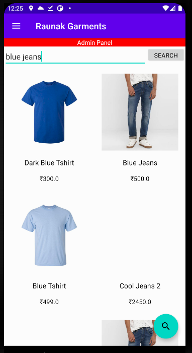
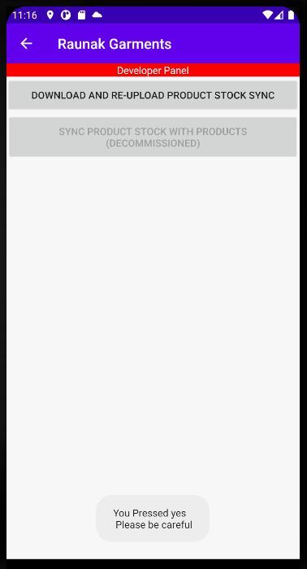

# Raunak Garment's ecommerce app for shopping.  

## Client flows  

### Client flow without interruptions  
 
 <table>
   <tr>
        <td>Login screen</td>
        <td>Home screen</td>
        <td>Logout option</td>
   </tr>
   <tr>
        <td></td>
        <td></td>
        <td></td>
   </tr>
 </table>

 <table>
   <tr>
        <td>Switch account popup on logout</td>
        <td>Navigation bar by clicking on stack structure on top left</td>
        <td>Search product</td>
   </tr>
   <tr>
        <td></td>
        <td></td>
        <td></td>
   </tr>
 </table>

<table>
   <tr>
        <td>Click on product from home screen</td>
        <td>Cart Screen</td>
        <td>Confirm Screen</td>
   </tr>
   <tr>
        <td></td>
        <td></td>
        <td></td>
   </tr>
 </table>
 
 <table>
    <tr>
         <td>Pay with razorpay screen</td>
         <td>Razorpay API window</td>
    </tr>
    <tr>
         <td></td>
         <td></td>
    </tr>
  </table> 

### User order flow  

<table>
   <tr>
        <td>Click on product from home screen</td>
        <td>Cart Screen</td>
        <td>Confirm Screen</td>
   </tr>
   <tr>
        <td></td>
        <td></td>
        <td></td>
   </tr>
 </table>
 

<table>
   <tr>
        <td>Click on product from home screen</td>
        <td>Cart Screen</td>
        <td>Confirm Screen</td>
   </tr>
   <tr>
        <td></td>
        <td></td>
        <td></td>
   </tr>
 </table>

<table>
   <tr>
        <td>Click on product from home screen</td>
        <td>Cart Screen</td>
        <td>Confirm Screen</td>
   </tr>
   <tr>
        <td></td>
        <td></td>
        <td></td>
   </tr>
 </table>

<table>
   <tr>
        <td>Click on product from home screen</td>
        <td>Cart Screen</td>
        <td>Confirm Screen</td>
   </tr>
   <tr>
        <td></td>
        <td></td>
        <td></td>
   </tr>
 </table>

<table>
   <tr>
        <td>Click on product from home screen</td>
        <td>Cart Screen</td>
        <td>Confirm Screen</td>
   </tr>
   <tr>
        <td></td>
        <td></td>
        <td></td>
   </tr>
 </table>

###  Empty cart flow  

<table>
   <tr>
        <td>Click on product from home screen</td>
        <td>Cart Screen</td>
   </tr>
   <tr>
        <td></td>
        <td></td>
   </tr>
 </table>
  
### Profile fields  

<table>
   <tr>
        <td>Click on product from home screen</td>
        <td>Cart Screen</td>
   </tr>
   <tr>
        <td></td>
        <td></td>
   </tr>
 </table>

### Profile fields error flow  

<table>
   <tr>
        <td>Click on product from home screen</td>
        <td>Cart Screen</td>
        <td>Confirm Screen</td>
   </tr>
   <tr>
        <td></td>
        <td></td>
        <td></td>
   </tr>
 </table>

<table>
   <tr>
        <td>Click on product from home screen</td>
        <td>Cart Screen</td>
        <td>Confirm Screen</td>
   </tr>
   <tr>
        <td></td>
        <td></td>
        <td></td>
   </tr>
 </table>

### Client flow for settings  

<table>
   <tr>
        <td>Click on product from home screen</td>
        <td>Cart Screen</td>
        <td>Confirm Screen</td>
   </tr>
   <tr>
        <td></td>
        <td></td>
        <td></td>
   </tr>
 </table>
 
 <table>
    <tr>
         <td>Click on product from home screen</td>
         <td>Cart Screen</td>
         <td>Confirm Screen</td>
    </tr>
    <tr>
         <td></td>
         <td></td>
         <td></td>
    </tr>
  </table>

<table>
   <tr>
        <td>Click on product from home screen</td>
        <td>Cart Screen</td>
        <td>Confirm Screen</td>
   </tr>
   <tr>
        <td></td>
        <td></td>
        <td></td>
   </tr>
 </table>

<table>
   <tr>
        <td>Click on product from home screen</td>
        <td>Cart Screen</td>
        <td>Confirm Screen</td>
   </tr>
   <tr>
        <td></td>
        <td></td>
        <td></td>
   </tr>
 </table>

<table>
   <tr>
        <td>Click on product from home screen</td>
        <td>Cart Screen</td>
        <td>Confirm Screen</td>
   </tr>
   <tr>
        <td></td>
        <td></td>
        <td></td>
   </tr>
 </table>

<table>
   <tr>
        <td>Click on product from home screen</td>
        <td>Cart Screen</td>
        <td>Confirm Screen</td>
   </tr>
   <tr>
        <td></td>
        <td></td>
        <td></td>
   </tr>
 </table>

<table>
   <tr>
        <td>Click on product from home screen</td>
   </tr>
   <tr>
        <td></td>
   </tr>
 </table>
 

### Client flow for contact us screen  
<table>
   <tr>
        <td>Click on product from home screen</td>
   </tr>
   <tr>
        <td></td>
   </tr>
 </table>

## Admin flows  

### Admin navigation flow  

<table>
   <tr>
        <td>Click on product from home screen</td>
        <td>Cart Screen</td>
        <td>Confirm Screen</td>
   </tr>
   <tr>
        <td></td>
        <td></td>
        <td></td>
   </tr>
 </table>

### Add product flow  

<table>
   <tr>
        <td>Click on product from home screen</td>
        <td>Cart Screen</td>
        <td>Confirm Screen</td>
   </tr>
   <tr>
        <td></td>
        <td></td>
        <td></td>
   </tr>
 </table>

<table>
   <tr>
        <td>Click on product from home screen</td>
        <td>Cart Screen</td>
        <td>Confirm Screen</td>
   </tr>
   <tr>
        <td></td>
        <td></td>
        <td></td>
   </tr>
 </table>

<table>
   <tr>
        <td>Click on product from home screen</td>
        <td>Cart Screen</td>
        <td>Confirm Screen</td>
   </tr>
   <tr>
        <td></td>
        <td></td>
        <td></td>
   </tr>
 </table>

<table>
   <tr>
        <td>Click on product from home screen</td>
        <td>Cart Screen</td>
        <td>Confirm Screen</td>
   </tr>
   <tr>
        <td></td>
        <td></td>
        <td></td>
   </tr>
 </table>

<table>
   <tr>
        <td>Click on product from home screen</td>
   </tr>
   <tr>
        <td></td>
   </tr>
 </table>

### Edit product flow  

<table>
   <tr>
        <td>Click on product from home screen</td>
        <td>Cart Screen</td>
        <td>Confirm Screen</td>
   </tr>
   <tr>
        <td></td>
        <td></td>
        <td></td>
   </tr>
 </table>
 

<table>
   <tr>
        <td>Click on product from home screen</td>
        <td>Cart Screen</td>
        <td>Confirm Screen</td>
   </tr>
   <tr>
        <td></td>
        <td></td>
        <td></td>
   </tr>
 </table>

<table>
   <tr>
        <td>Click on product from home screen</td>
        <td>Cart Screen</td>
        <td>Confirm Screen</td>
   </tr>
   <tr>
        <td></td>
        <td></td>
        <td></td>
   </tr>
 </table>

<table>
   <tr>
        <td>Click on product from home screen</td>
        <td>Cart Screen</td>
        <td>Confirm Screen</td>
   </tr>
   <tr>
        <td></td>
        <td></td>
        <td></td>
   </tr>
 </table>

<table>
   <tr>
        <td>Click on product from home screen</td>
        <td>Cart Screen</td>
        <td>Confirm Screen</td>
   </tr>
   <tr>
        <td></td>
        <td></td>
        <td></td>
   </tr>
 </table>

<table>
   <tr>
        <td>Click on product from home screen</td>
        <td>Cart Screen</td>
        <td>Confirm Screen</td>
   </tr>
   <tr>
        <td></td>
        <td></td>
        <td></td>
   </tr>
 </table>

<table>
   <tr>
        <td>Click on product from home screen</td>
        <td>Cart Screen</td>
        <td>Confirm Screen</td>
   </tr>
   <tr>
        <td></td>
        <td></td>
        <td></td>
   </tr>
 </table>

### Delete product flow  

<table>
   <tr>
        <td>Click on product from home screen</td>
        <td>Cart Screen</td>
        <td>Confirm Screen</td>
   </tr>
   <tr>
        <td></td>
        <td></td>
        <td></td>
   </tr>
 </table>

<table>
   <tr>
        <td>Click on product from home screen</td>
        <td>Cart Screen</td>
        <td>Confirm Screen</td>
   </tr>
   <tr>
        <td></td>
        <td></td>
        <td></td>
   </tr>
 </table>

<table>
   <tr>
        <td>Click on product from home screen</td>
        <td>Cart Screen</td>
        <td>Confirm Screen</td>
   </tr>
   <tr>
        <td></td>
        <td></td>
        <td></td>
   </tr>
 </table>

<table>
   <tr>
        <td>Click on product from home screen</td>
        <td>Cart Screen</td>
   </tr>
   <tr>
        <td></td>
        <td></td>
   </tr>
 </table>

### Orders flow  

<table>
   <tr>
        <td>Click on product from home screen</td>
        <td>Cart Screen</td>
        <td>Confirm Screen</td>
   </tr>
   <tr>
        <td></td>
        <td></td>
        <td></td>
   </tr>
 </table>

<table>
   <tr>
        <td>Click on product from home screen</td>
        <td>Cart Screen</td>
        <td>Confirm Screen</td>
   </tr>
   <tr>
        <td></td>
        <td></td>
        <td></td>
   </tr>
 </table>

<table>
   <tr>
        <td>Click on product from home screen</td>
        <td>Cart Screen</td>
        <td>Confirm Screen</td>
   </tr>
   <tr>
        <td></td>
        <td></td>
        <td></td>
   </tr>
 </table>

<table>
   <tr>
        <td>Click on product from home screen</td>
        <td>Cart Screen</td>
        <td>Confirm Screen</td>
   </tr>
   <tr>
        <td></td>
        <td></td>
        <td></td>
   </tr>
 </table>

<table>
   <tr>
        <td>Click on product from home screen</td>
        <td>Cart Screen</td>
        <td>Confirm Screen</td>
   </tr>
   <tr>
        <td></td>
        <td></td>
        <td></td>
   </tr>
 </table>

<table>
   <tr>
        <td>Click on product from home screen</td>
        <td>Cart Screen</td>
   </tr>
   <tr>
        <td></td>
        <td></td>
   </tr>
 </table>
 
### Functions flow  

<table>
   <tr>
        <td>Click on product from home screen</td>
        <td>Cart Screen</td>
        <td>Confirm Screen</td>
   </tr>
   <tr>
        <td></td>
        <td></td>
        <td></td>
   </tr>
 </table>

<table>
   <tr>
        <td>Click on product from home screen</td>
        <td>Cart Screen</td>
        <td>Confirm Screen</td>
   </tr>
   <tr>
        <td></td>
        <td></td>
        <td></td>
   </tr>
 </table>

<table>
   <tr>
        <td>Click on product from home screen</td>
        <td>Cart Screen</td>
        <td>Confirm Screen</td>
   </tr>
   <tr>
        <td></td>
        <td></td>
        <td></td>
   </tr>
 </table>

<table>
   <tr>
        <td>Click on product from home screen</td>
        <td>Cart Screen</td>
        <td>Confirm Screen</td>
   </tr>
   <tr>
        <td></td>
        <td></td>
        <td></td>
   </tr>
 </table>

<table>
   <tr>
        <td>Click on product from home screen</td>
        <td>Cart Screen</td>
        <td>Confirm Screen</td>
   </tr>
   <tr>
        <td></td>
        <td></td>
        <td></td>
   </tr>
 </table>

<table>
   <tr>
        <td>Click on product from home screen</td>
        <td>Cart Screen</td>
        <td>Confirm Screen</td>
   </tr>
   <tr>
        <td></td>
        <td></td>
        <td></td>
   </tr>
 </table>

<table>
   <tr>
        <td>Click on product from home screen</td>
        <td>Cart Screen</td>
        <td>Confirm Screen</td>
   </tr>
   <tr>
        <td></td>
        <td></td>
        <td></td>
   </tr>
 </table>

<table>
   <tr>
        <td>Click on product from home screen</td>
        <td>Cart Screen</td>
        <td>Confirm Screen</td>
   </tr>
   <tr>
        <td></td>
        <td></td>
        <td></td>
   </tr>
 </table>

<table>
   <tr>
        <td>Click on product from home screen</td>
        <td>Cart Screen</td>
        <td>Confirm Screen</td>
   </tr>
   <tr>
        <td></td>
        <td></td>
        <td></td>
   </tr>
 </table>

<table>
   <tr>
        <td>Click on product from home screen</td>
        <td>Cart Screen</td>
   </tr>
   <tr>
        <td></td>
        <td></td>
   </tr>
 </table>
   
### Developer flow  

<table>
   <tr>
        <td>Click on product from home screen</td>
        <td>Cart Screen</td>
        <td>Confirm Screen</td>
   </tr>
   <tr>
        <td></td>
        <td></td>
        <td></td>
   </tr>
 </table>
 